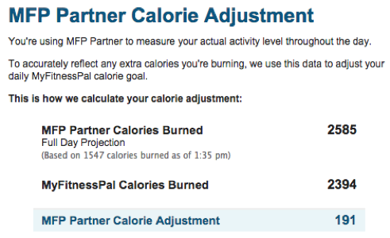

# Calorie Adjustments

After logging a series of step entries via the API, if you were to look at your exercise diary on MyFitnessPal, you might see something like this:

What explains the difference between **M​FP Partner Calories Burned**​ and **M​yFitnessPal Calories Burned**​? What does the ​**Full Day Projection​** mean? And what does **​MFP Partner Calorie Adjustment**​ mean?

To fully explain these concepts, we must first provide a few definitions:

    Resting Metabolic Rate (RMR)​ – how many calories a person would burn simply by laying in bed all day. (This is the same as the term commonly known as the ​Basal Metabolic Rate​.) This value varies from person to person, and is influenced by factors such as height, weight, sex, and age.

    Physical Activity Level (PAL)​ – a value representing a person's average activity level throughout the day. This value ranges from 1.2, representing individuals with a sedentary lifestyle, to 2.4, representing extremely active people, such as competitive cyclists.

    Base Metabolic Rate (BMR)​ – this is a person's estimated daily calorie burn. MyFitnessPal estimates this with the formula RMR * PAL.
    
With the use of an activity tracker, a person can get a more accurate picture of their daily energy expenditure. In this scenario, MyFitnessPal creates a calorie adjustment to account for the difference between the tracker­measured activity and the BMR.

The ​**Full Day Projection​** of tracker activity is calculated by adding the actual energy expenditure (1,547 calories in the above screenshot) to the remaining BMR in the day. As the day progresses, the **​Full Day Projection​** begins to resemble the actual expenditure more closely, as there is less BMR estimation left to add to it.

The ​**MFP Partner Calorie Adjustment​** value is achieved by taking the difference between the **MFP Partner Calories Burned**​ projection and the **​MyFitnessPal Calories Burned​** estimate. (If the difference is negative, the adjustment will be zero unless the user has enabled negative calorie adjustments in their profile settings.)

## Handling Discrete Exercise Entries

A MyFitnessPal user may also create discrete exercise entries, indicating energy burned as the result of a run, a bike ride, or a yoga class. For people who use an activity tracker, discrete exercise entries must include a start time as well as a duration. The inclusion of a start time allows for prevention of duplication of energy burn: For the duration of a discrete exercise entry, energy burn from step­tracking activity is excluded from the daily count.

In the example screenshot, the ​**MyFitnessPal Calories Burned​** is the user's ​**BMR**;​ if the user were to log any discrete exercise activity, such as running, biking, or ballet, the energy burned during that activity would be added to this value.